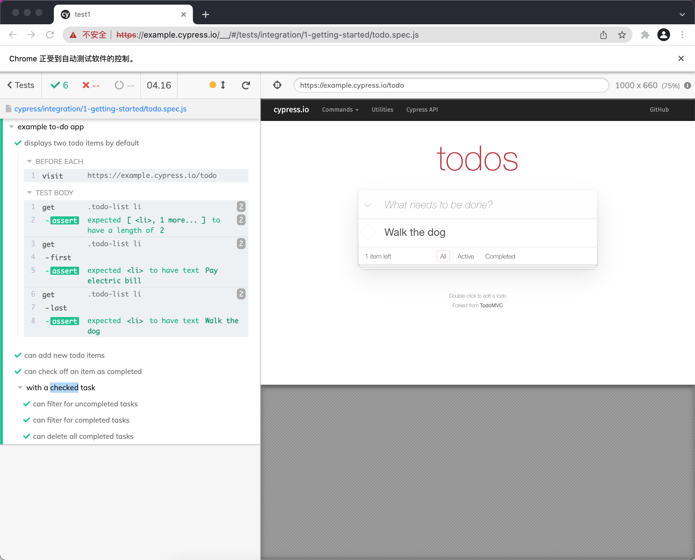
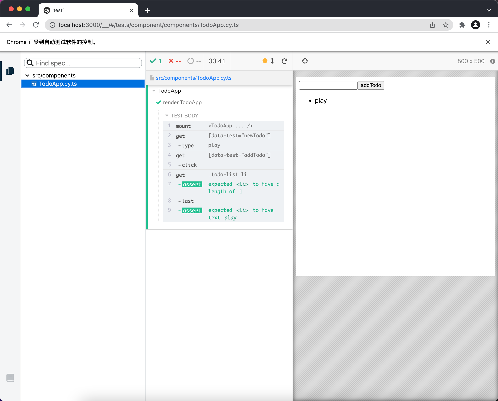
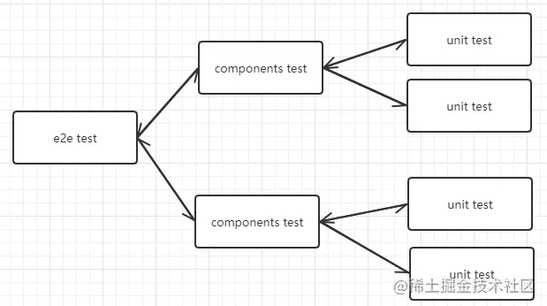

# Vite2 自动化测试-e2e

## 1 初始化

### 1.1 安装

```js
mkdir vite-test-e2e
cd vite-test-e2e
npm init -y

pnpm install vue
pnpm i vite @vitejs/plugin-vue -D
pnpm install @babel/core @babel/preset-env  typescript @babel/preset-typescript  -D
pnpm install jest ts-jest ts-node @types/node @types/jest babel-jest @vue/vue3-jest -D
pnpm install  @vue/test-utils@next jest-transform-stub -D
echo done
```

### 1.2 tsconfig.node.json

- [compiler-options](https://www.typescriptlang.org/docs/handbook/project-references.html)

```json
{
  "compilerOptions": {
    "composite": true,
    "module": "esnext",
    "moduleResolution": "node",
    "skipLibCheck": true
  },
  "include": ["vite.config.ts"]
}
```

### 2.3 tsconfig.json

tsconfig.json

```json
{
  "compilerOptions": {
    "target": "esnext",
    "useDefineForClassFields": true,
    "module": "esnext",
    "moduleResolution": "node",
    "strict": true,
    "jsx": "preserve",
    "sourceMap": true,
    "resolveJsonModule": true,
    "esModuleInterop": true,
    "lib": ["esnext", "dom"],
    "skipLibCheck": true,
    "strictNullChecks": true,
    "noEmit": true,
    "noEmitOnError": true,
    "baseUrl": ".",
    "paths": {
      "@/*": ["src/*"]
    }
  },
  "include": ["src/**/*.ts", "src/**/*.d.ts", "src/**/*.tsx", "src/**/*.vue"],
  "references": [{ "path": "./tsconfig.node.json" }]
}
```

### 1.4 vite.config.ts

- [config](https://vitejs.cn/config/)

vite.config.ts

```js
import { defineConfig } from "vite";
import vue from "@vitejs/plugin-vue";
import { resolve } from "path";
export default defineConfig({
  plugins: [vue()],
  resolve: {
    alias: {
      "@": resolve("src"),
    },
  },
});
```

### 1.5 package.json

package.json

```json
{
  "scripts": {
    "dev": "vite",
    "build": "vite build"
  }
}
```

### 1.6 index.html

index.html

```html
<!DOCTYPE html>
<html lang="en">
  <head>
    <meta charset="UTF-8" />
    <meta name="viewport" content="width=device-width, initial-scale=1.0" />
    <title>Vite App</title>
  </head>

  <body>
    <div id="app"></div>
    <script type="module" src="/src/main.ts"></script>
  </body>
</html>
```

### 1.7 .gitignore

.gitignore

```js
# Logs
logs
*.log
npm-debug.log*
yarn-debug.log*
yarn-error.log*
pnpm-debug.log*
lerna-debug.log*

node_modules
dist
dist-ssr
*.local

# Editor directories and files
.vscode/*
!.vscode/extensions.json
.idea
.DS_Store
*.suo
*.ntvs*
*.njsproj
*.sln
*.sw?
```

### 1.8 src/main.ts

src/main.ts

```js
import { createApp } from "vue";
import App from "./App.vue";

createApp(App).mount("#app");
```

### 1.9 src/env.d.ts

src/env.d.ts

```js
/// <reference types="vite/client" />

declare module '*.vue' {
  import type { DefineComponent } from 'vue'
  // eslint-disable-next-line @typescript-eslint/no-explicit-any, @typescript-eslint/ban-types
  const component: DefineComponent<{}, {}, any>
  export default component
}
```

### 1.10 src/App.vue

src/App.vue

```js
<script setup lang="ts">
import TodoApp from './components/TodoApp.vue'
</script>

<template>
  <TodoApp/>
</template>

<style></style>
```

### 1.11 TodoApp.vue

src/components/TodoApp.vue

```js
<template>
  
  <input data-test="newTodo" />
  <button data-test="addTodo">addTodo</button>
</template>
<script setup lang="ts">
import logoUrl from "@/assets/logo.png"
</script>
<style scoped>
img{
  width:50px;
}
</style>
```

## 2 添加单元测试

- [jestjs](https://www.jestjs.cn/)

### 2.1 package.json

package.json

```diff
{
    "scripts": {
    "dev": "vite",
    "build": "vite build",
+   "test": "jest"
  },
}
```

### 2.2 src/sum.ts

src/sum.ts

```js
export default function (a: number, b: number) {
  return a + b;
}
```

### 2.3 添加sum方法的测试用例

src/sum.spec.ts

```js
import sum from "./sum";
it("test sum", () => {
  expect(sum(1, 2)).toBe(3);
});
```

### 2.4 babel.config.ts

babel.config.ts

```js
export default {
  presets: ["@babel/preset-env", "@babel/preset-typescript"],
};
```

### 2.5 jest.config.ts

- [configuration](https://www.jestjs.cn/docs/configuration)

jest.config.ts

```js
import type { Config } from "@jest/types";
const config: Config.InitialOptions = {
  transform: {
    "^.+\\.js$": "babel-jest",
    "^.+\\.ts$": "ts-jest",
  },
  testMatch: ["<rootDir>/src/**/*.spec.(t|j)s"],
  testEnvironment: "jsdom",
  transformIgnorePatterns: ["/node_modules/"],
};
export default config;
```

## 3 测试组件

### 3.1 添加 TodoApp组件的测试用例

- [expect](https://www.jestjs.cn/docs/expect)

src/components/TodoApp.spec.ts

```js
import { mount } from "@vue/test-utils";
import TodoApp from "./TodoApp.vue";

test("render todoApp", () => {
  const wrapper = mount(TodoApp);
  const addTodo = wrapper.get('[data-test="addTodo"]');
  expect(addTodo.text()).toBe("addTodo");
});
```

### 3.1 jest.config.ts

jest.config.ts

```diff
import type { Config } from '@jest/types';
const config: Config.InitialOptions = {
   transform: {
    "^.+\\.js$": "babel-jest",
    "^.+\\.ts$": "ts-jest",
+   // 配置.vue结尾的文件使用的测试库
+   "^.+\\.vue$": "@vue/vue3-jest",
+   // 其他文件类型的转换
+   ".+\\.(css|scss|png|jpg|svg)$": "jest-transform-stub"
  },
+ moduleNameMapper: {
+   "^@/(.*)$": "<rootDir>/src/$1"
+ },
  testMatch: ["<rootDir>/src/**/*.spec.(t|j)s"],
  testEnvironment: "jsdom",
  transformIgnorePatterns: ["/node_modules/"]
};
export default config;
```

## 4 代码覆盖率

### 4.1 package.json 添加代码覆盖率

```diff
{
    "scripts": {
    "dev": "vite",
    "build": "vite build",
    "test": "jest",
+   "test:coverage": "jest --coverage"
  },
}
```

### 4.2 jest 配置添加代码覆盖率统计

jest.config.ts

```diff
import type { Config } from '@jest/types';
const config: Config.InitialOptions = {
  transform: {
    "^.+\\.js$": "babel-jest",
    "^.+\\.ts$": "ts-jest",
    "^.+\\.vue$": "@vue/vue3-jest",
    ".+\\.(css|scss|png|jpg|svg)$": "jest-transform-stub"
  },
  moduleNameMapper: {
    "^@/(.*)$": "<rootDir>/src/$1"
  },
  testMatch: ["<rootDir>/src/**/*.spec.(t|j)s"],
  testEnvironment: "jsdom",
+ transformIgnorePatterns: ["/node_modules/"],
+ coverageDirectory: "coverage",
+ coverageProvider: "v8",
+ collectCoverageFrom: ["src/**/*.{js,vue}", "!src/main.ts", "!src/App.vue"],
+ coverageThreshold: {
+   global: {
+     branches: 40,
+     functions: 80,
+     lines: 90,
+     statements: 80
+   }
+ }
};
export default config;
```

## 5 E2E 测试

- [cypress](https://docs.cypress.io/)
- [Clashing-types-with-Jest](https://docs.cypress.io/guides/tooling/typescript-support#Clashing-types-with-Jest)
- [patch-package](https://www.npmjs.com/package/patch-package)

### 5.1 安装

```js
pnpm install cypress -D
pnpm install @cypress/vue@next @cypress/vite-dev-server -D
echo done
```

### 5.2 TodoApp.vue

src/components/TodoApp.vue

```diff
<template>
+ <input data-test="newTodo" v-model="newTodo" />
+ <button data-test="addTodo" @click="addTodo">addTodo</button>
+ <ul class="todo-list">
+   <li v-for="todo in todoList">{{ todo.text }}</li>
+ </ul>
</template>
<script setup lang="ts">
+import { ref, reactive } from 'vue';
+interface Todo {
+  text: string;
+}
+const newTodo = ref('');
+const todoList = reactive<Array<Todo>>([]);
+const addTodo = () => {
+  todoList.push({ text: newTodo.value });
+  newTodo.value = '';
+}
</script>
```

### 5.3 添加TodoApp组件的 `cypress` 测试文件

src/components/TodoApp.cy.ts

```js
import { mount } from "@cypress/vue";
import TodoApp from "./TodoApp.vue";
describe("TodoApp", () => {
  it("render TodoApp", () => {
    mount(TodoApp);
    const text = "play";
    cy.get('[data-test="newTodo"]').type(text);
    cy.get('[data-test="addTodo"]').click();
    cy.get(".todo-list li")
      .should("have.length", 1)
      .last()
      .should("have.text", text);
  });
});
```

### 5.4 todoApp.spec.js

- [get](https://docs.cypress.io/api/commands/get)

cypress/integration/1-getting-started/todoApp.spec.js

```js
/// <reference types="cypress" />
describe("TodoApp", () => {
  beforeEach(() => {
    cy.visit("http://127.0.0.1:3000");
  });
  it("can add new todo items", () => {
    const text = "play";
    cy.get('[data-test="newTodo"]').type(text);
    cy.get('[data-test="addTodo"]').click();
    cy.get(".todo-list li")
      .should("have.length", 1)
      .last()
      .should("have.text", text);
  });
});
```

### 5.5 plugins/index.js

- [dev-server:start](https://www.cypress.io/blog/2021/04/06/getting-start-with-cypress-component-testing-vue-2-3/#configuringthecypresscomponenttestrunner)

cypress/plugins/index.js

```js
const { startDevServer } = require("@cypress/vite-dev-server");
module.exports = (on, config) => {
  on("dev-server:start", async (options) => startDevServer({ options }));
};
```

### 5.6 添加 cypress 配置文件

cypress.json

```json
{
  "component": {
    "testFiles": "**/*.cy.{js,ts,jsx,tsx}",
    "componentFolder": "src"
  }
}
```

### 5.7 package.json添加cypress e2e测试命令

package.json

```diff
{
  "scripts": {
    "dev": "vite",
    "build": "vite build",
    "test": "jest",
    "test:coverage": "jest --coverage",
+   "test:e2e": "cypress open",
+   "test:ct": "cypress open-ct"
  },
}
```

执行下看看`e2e`测试结果：

```bash
yarn test:e2e

# npm run test:e2e
```



可以看到启动Cypress打开了一个新的无头浏览器窗口，这个窗其实是 `Cypress Test Runner` 开发的一个视窗，一般开发时我们会使用 `cypress open` 命令来启动 这个`Test Runner` 的窗口便于开发。

第二个命令 `test:ct` 表示支持开发过程**热重启**



### 5.8 index.d.ts

node_modules/cypress/types/index.d.ts

```js
// <reference path="./cypress-expect.d.ts" />
```

### 5.9 cypress-expect.d.ts 去除声明 `expect` 和 `assert`

node_modules/cypress/types/cypress-expect.d.ts

```js
//declare const expect: Chai.ExpectStatic
//declare const assert: Chai.AssertStatic
```

## 6 组件测试的流程

- 整个 **e2e 测试**的过程包含 **组件测试(component test)**，然后**组件测试(component test)** 包含 **单元测试(unit test)**;
- 当 **单元测试（unit test）** 通过后，再通过组件测试，最后通过 **e2e test （端到端测试）**

借助掘金上的图如下:



[代码仓库](https://github.com/GolderBrother/vite-test-e2e)

## 7.参考链接

- [vitejs](https://vitejs.cn/)
- [tslang](https://www.tslang.cn/)
- [Cypress](https://www.cypress.io/)
- [Cypress vue](https://www.cypress.io/blog/2021/04/06/getting-start-with-cypress-component-testing-vue-2-3/)